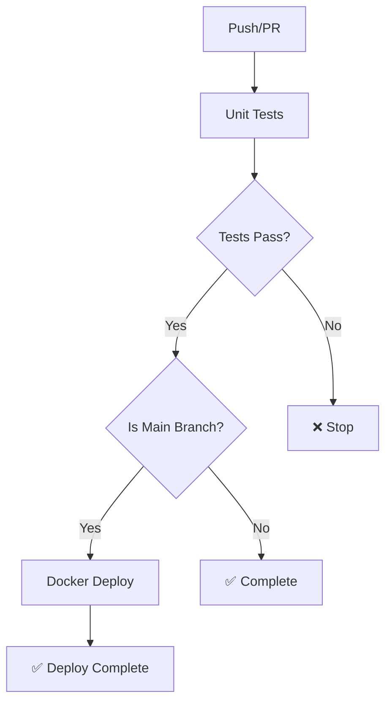

# VocalBorn CI/CD Pipeline 說明

## 🔄 Workflow 架構

本專案採用分離式 CI/CD 架構，將不同職責分為獨立的 workflow 檔案：

### 📁 Workflow 檔案

1. **`unit-tests.yml`** - 單元測試流程
2. **`docker-deploy.yml`** - Docker 構建與部署流程
3. **`.code-quality.yml.disabled`** - 程式碼品質檢查（已停用）

## 🧪 Unit Tests Workflow (`unit-tests.yml`)

### 觸發條件
- **所有分支的 Push 事件**
- **Pull Request 到 main 分支**
- **手動觸發**

### 執行內容
- 設定 Python 3.13 測試環境
- 安裝專案依賴項
- 配置測試環境變數
- 執行單元測試（忽略需要外部服務的測試）
- 生成測試覆蓋率報告
- 上傳測試結果作為 artifacts

## 🐳 Docker Deploy Workflow (`docker-deploy.yml`)

### 觸發條件
- **僅 main 分支的 Push 事件**
- **手動觸發（僅限 main 分支）**

### 執行階段
1. **檢查測試狀態**：等待並確認 Unit Tests 通過
2. **Docker 構建與推送**：
   - 多平台映像構建（linux/amd64, linux/arm64）
   - 推送到 Docker Hub
   - 智能標籤管理和快取優化

## 🛡️ 安全保證

- **分離式執行**：測試與部署流程完全分離，職責清晰
- **依賴檢查**：Docker 部署必須等待測試通過
- **分支保護**：只有 main 分支的變更才會觸發 Docker 推送
- **環境隔離**：測試使用獨立的 SQLite 測試資料庫
- **智能忽略**：跳過需要外部服務的測試，確保 CI 穩定性

## 📊 執行矩陣

| 分支類型 | Unit Tests | Docker Deploy |
|---------|------------|---------------|
| `main` | ✅ | ✅ (測試通過後) |
| `develop` | ✅ | ❌ |
| `feature/*` | ✅ | ❌ |
| `fix/*` | ✅ | ❌ |
| PR to main | ✅ | ❌ |

## 🔧 Workflow 依賴關係



## 🔧 本地測試

在推送前，建議先在本地執行測試：

```bash
# 執行單元測試
python -m pytest tests/ -v --disable-warnings \
  --ignore=tests/storage/test_audio_storage_service.py \
  --ignore=tests/therapist/test_therapist_service.py \
  -k "not test_send_email"

```

這個設計確保了每次程式碼變更都經過嚴格的測試驗證，同時只有經過完整測試的 main 分支變更才會部署到生產環境。