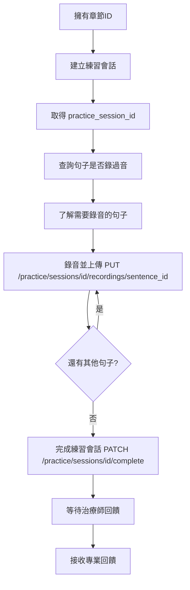

# 練習 API 功能文件

## 備註
這個檔案只是簡單說明一下流程，具體的API細節還是得要去看API Docs

## 使用指南

### 完整練習流程

#### 1. 開始新的練習會話
**POST** `/practice/sessions`

```json
{
    "chapter_id": "你的章節UUID"
}
```

**回應：**會得到 `practice_session_id` 和該章節的基本資訊（總句子數、進度等）

#### 2. 查詢練習記錄（了解需要錄音的句子）
**GET** `/practice/sessions/{practice_session_id}/records`

**回應：**會得到該會話中所有句子的練習記錄，包含：
- `sentence_id`
- `sentence_content`（句子內容）
- `sentence_name`（句子名稱）
- `record_status`（錄音狀態：pending, recorded 等）

#### 3. 為每個句子上傳錄音
對於每個 `sentence_id`，使用：
**PUT** `/practice/sessions/{practice_session_id}/recordings/{sentence_id}`

上傳音訊檔案（支援 MP3、WAV、M4A 等格式）

⚠️ **重要**：PUT 語義確保一個句子只會有一個錄音檔案，重複上傳會覆蓋舊檔案

#### 4. 完成練習會話（可選）
**PATCH** `/practice/sessions/{practice_session_id}/complete`

這會設定會話為已完成狀態並計算總時長

### 查詢和管理

#### 查詢已有的練習會話
如果想查看該章節之前的練習記錄：
**GET** `/practice/chapters/{chapter_id}/sessions`

#### 查詢會話中的錄音
**GET** `/practice/sessions/{practice_session_id}/recordings`

#### 查詢特定句子的錄音
**GET** `/practice/sessions/{practice_session_id}/recordings/{sentence_id}`

## 功能流程

### 1. 語言障礙者練習流程



### 2. 治療師分析流程
尚未完成

### 3. AI 分析流程
尚未完成

