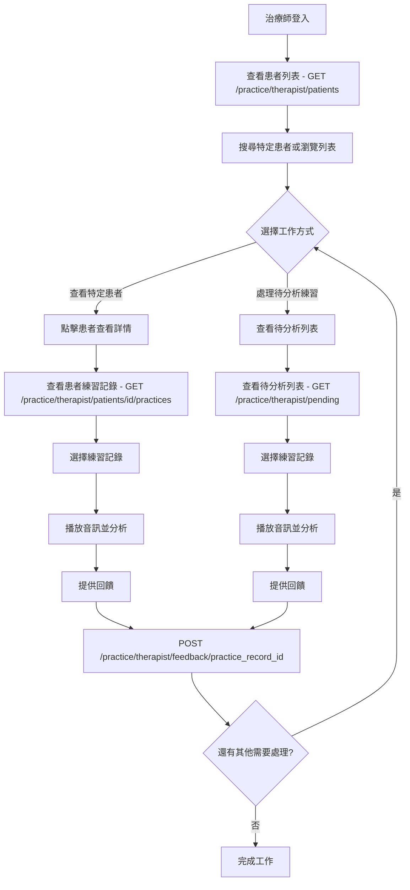
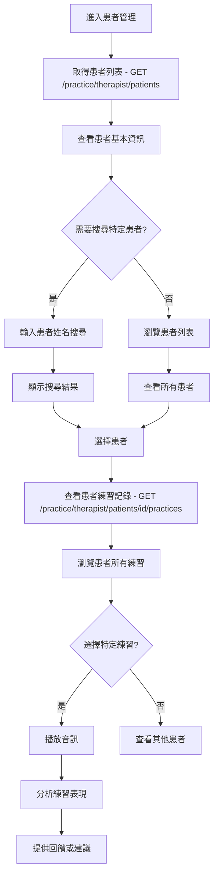
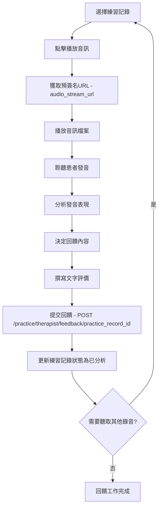
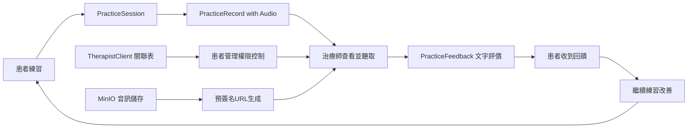

# 治療師練習管理API改善計畫

## 📋 計畫概述

### 現狀分析
目前VocalBorn系統的治療師API功能相對基礎，主要提供：
- 待分析練習列表查詢
- 基本回饋CRUD操作
- 簡單的回饋列表查詢

### 主要問題點
1. **患者管理功能缺失** - 治療師無法方便查詢患者練習狀況
2. **音訊播放不便** - 缺少直接播放患者錄音的功能
3. **回饋流程複雜** - 需要更簡潔的文字評價功能

### 改善目標
- **簡化患者查詢** - 讓治療師能快速查看患者練習記錄
- **整合音訊播放** - 提供直接聽取患者錄音的功能
- **優化回饋流程** - 簡化文字評價的提交流程

## 🚀 核心API端點規格

### 1. 簡化患者管理API

#### 1.1 GET `/practice/therapist/patients`
**功能**：取得治療師的患者列表

**請求參數**：
```json
{
  "skip": 0,
  "limit": 20,
  "search": "患者姓名搜尋"
}
```

**回應格式**：
```json
{
  "total": 15,
  "patients": [
    {
      "patient_id": "uuid",
      "patient_name": "王小明", 
      "last_practice_date": "2025-07-20T14:30:00Z",
      "total_practice_sessions": 25,
      "pending_feedback_count": 3
    }
  ]
}
```

**使用方式**：
- 治療師查看所有患者列表
- 支援按患者姓名搜尋
- 顯示基本練習統計資訊

#### 1.2 GET `/practice/therapist/patients/overview`
**功能**：取得所有患者的練習章節與進度概覽

**查詢參數**：
```json
{
  "skip": 0,
  "limit": 20,
  "search": "患者姓名搜尋"
}
```

**回應格式**：
```json
{
  "total": 15,
  "patients_overview": [
    {
      "patient_id": "uuid",
      "patient_name": "王小明",
      "last_practice_date": "2025-07-20T14:30:00Z",
      "total_practice_sessions": 25,
      "chapter_progress": [
        {
          "chapter_id": "uuid",
          "chapter_name": "基本對話",
          "total_sentences": 20,
          "completed_sentences": 18,
          "completion_rate": 90.0,
          "last_practiced": "2025-07-20T14:30:00Z",
          "pending_feedback": 2
        },
        {
          "chapter_id": "uuid",
          "chapter_name": "進階表達",
          "total_sentences": 15,
          "completed_sentences": 5,
          "completion_rate": 33.3,
          "last_practiced": "2025-07-18T14:30:00Z", 
          "pending_feedback": 1
        }
      ],
      "overall_completion_rate": 72.9,
      "total_pending_feedback": 3
    }
  ]
}
```

**使用方式**：
- **一次檢視所有患者的練習章節與進度**
- 快速識別每個患者在各章節的完成度
- 查看哪些章節需要更多練習
- 識別待回饋的練習數量

#### 1.3 GET `/practice/therapist/patients/{patient_id}/practices`
**功能**：取得患者的練習記錄列表（包含音訊播放功能）

**路徑參數**：
- `patient_id`: 患者UUID

**查詢參數**：
```json
{
  "skip": 0,
  "limit": 20,
  "status_filter": "all|pending|recorded|analyzed",
  "chapter_id": "特定章節篩選（可選）"
}
```

**回應格式**：
```json
{
  "patient_info": {
    "patient_id": "uuid",
    "patient_name": "王小明"
  },
  "total": 50,
  "practice_records": [
    {
      "practice_record_id": "uuid",
      "practice_session_id": "uuid", 
      "chapter_name": "基本對話",
      "sentence_id": "uuid",
      "sentence_content": "我想要一份牛肉麵，不要太辣",
      "sentence_name": "基本點餐對話",
      "record_status": "recorded",
      "audio_path": "/storage/audio/recording.mp3",
      "audio_duration": 30.5,
      "audio_stream_url": "https://presigned-url...",
      "audio_stream_expires_at": "2025-07-23T15:30:00Z",
      "recorded_at": "2025-07-20T14:30:00Z",
      "has_feedback": false
    }
  ]
}
```

**使用方式**：
- 查看特定患者的所有練習記錄
- 直接播放音訊檔案（透過 `audio_stream_url`）
- 篩選不同狀態的記錄或特定章節
- 快速識別需要回饋的記錄

### 2. 增強現有待分析功能

#### 2.1 GET `/practice/therapist/pending` (增強版)
**功能**：改善待分析練習功能，增加音訊播放功能

**請求參數**：
```json
{
  "skip": 0,
  "limit": 20,
  "patient_search": "患者姓名搜尋",
  "sort_by": "practice_date|patient_name",
  "order": "desc|asc"
}
```

**回應格式**：
```json
{
  "total": 25,
  "pending_practices": [
    {
      "practice_record_id": "uuid",
      "user_id": "uuid",
      "user_name": "王小明",
      "chapter_name": "基本對話",
      "sentence_id": "uuid",
      "sentence_content": "我想要一份牛肉麵，不要太辣",
      "sentence_name": "基本點餐對話",
      "audio_duration": 30.5,
      "audio_stream_url": "https://presigned-url...",
      "audio_stream_expires_at": "2025-07-23T15:30:00Z",
      "created_at": "2025-07-20T14:30:00Z",
      "days_since_practice": 3
    }
  ]
}
```

**使用方式**：
- 查看所有待分析的練習記錄
- 支援按患者姓名搜尋
- 直接播放音訊進行分析
- 按時間或患者名稱排序

### 3. 簡化回饋功能

**現有回饋API保持不變，只需確保音訊播放功能整合**
- `POST /practice/therapist/feedback/{practice_record_id}` - 提供文字回饋
- `GET /practice/therapist/feedback/{practice_record_id}` - 查看回饋
- `PUT /practice/therapist/feedback/{feedback_id}` - 修改回饋
- `DELETE /practice/therapist/feedback/{feedback_id}` - 刪除回饋

## 🔧 簡化技術實作規劃

### Schema設計

#### 新增Schema檔案
```python
# src/practice/schemas.py 新增內容

class TherapistPatientResponse(BaseModel):
    """治療師患者列表回應"""
    patient_id: UUID
    patient_name: str
    last_practice_date: Optional[datetime]
    total_practice_sessions: int
    pending_feedback_count: int

class TherapistPatientListResponse(BaseModel):
    """治療師患者列表"""
    total: int
    patients: List[TherapistPatientResponse]

class PatientPracticeRecordResponse(BaseModel):
    """患者練習記錄回應（含音訊）"""
    practice_record_id: UUID
    practice_session_id: UUID
    chapter_name: str
    sentence_id: UUID
    sentence_content: str
    sentence_name: str
    record_status: PracticeRecordStatus
    audio_path: Optional[str]
    audio_duration: Optional[float]
    audio_stream_url: Optional[str]
    audio_stream_expires_at: Optional[datetime]
    recorded_at: Optional[datetime]
    has_feedback: bool

class PatientPracticeListResponse(BaseModel):
    """患者練習列表回應"""
    patient_info: dict
    total: int
    practice_records: List[PatientPracticeRecordResponse]
```

### 服務層架構

#### 新增服務檔案
```python
# src/practice/services/therapist_patient_service.py
async def list_therapist_patients(
    therapist_id: UUID, 
    session: Session, 
    skip: int = 0, 
    limit: int = 20, 
    search: Optional[str] = None
) -> TherapistPatientListResponse

async def get_patient_practice_records(
    patient_id: UUID, 
    therapist_id: UUID, 
    session: Session,
    skip: int = 0,
    limit: int = 20,
    status_filter: Optional[str] = None
) -> PatientPracticeListResponse
```

#### 增強現有服務
```python
# src/practice/services/feedback_service.py 增強版
async def list_therapist_pending_practices_with_audio(
    therapist_id: UUID, 
    session: Session,
    skip: int = 0,
    limit: int = 20,
    patient_search: Optional[str] = None,
    sort_by: str = "practice_date",
    order: str = "desc"
) -> TherapistPendingPracticeListResponse
```

### 音訊播放功能整合

#### 音訊URL生成
```python
# src/storage/practice_recording_service.py 增強
async def generate_audio_stream_url(
    audio_path: str, 
    expires_in_hours: int = 1
) -> tuple[str, datetime]:
    """生成音訊播放的預簽名URL"""
    # 實作預簽名URL邏輯
    pass
```

## 📊 簡化實作優先級

### 第一階段（核心功能）
1. **患者列表API** - `GET /practice/therapist/patients`
2. **患者進度概覽API** - `GET /practice/therapist/patients/overview` ⭐ **新增**
3. **患者練習記錄API** - `GET /practice/therapist/patients/{id}/practices`  
4. **增強待分析功能** - `GET /practice/therapist/pending` 加入音訊播放

### 第二階段（音訊整合）
5. **音訊URL生成服務** - 整合到所有回應中
6. **前端播放器整合** - 確保音訊能正常播放

### 第三階段（優化）
7. **搜尋和篩選功能** - 完善查詢功能
8. **效能優化** - 資料庫索引和查詢優化

## 🧪 簡化測試策略

### 單元測試重點
- 患者查詢服務的業務邏輯正確性
- 音訊URL生成功能測試
- 權限驗證機制（確保治療師只能查看指派的患者）
- 錯誤處理邏輯

### 整合測試場景
- 患者列表API完整流程測試
- 音訊播放功能整合測試
- 回饋提交流程測試
- 權限控制整合測試

### 效能測試指標
- 患者列表查詢回應時間（< 300ms）
- 音訊URL生成速度（< 100ms）
- 分頁查詢效能測試

## 📱 簡化前端整合建議

### 患者管理頁面結構
```
患者管理
├── 搜尋區（患者姓名）
├── 患者列表（表格形式）
│   ├── 患者姓名
│   ├── 最後練習時間
│   ├── 待回饋數量
│   └── 查看詳情按鈕
└── 分頁控制區
```

### 患者練習記錄頁面結構
```
患者練習記錄
├── 患者基本資訊
├── 練習記錄列表
│   ├── 章節和句子資訊
│   ├── 音訊播放控制項
│   ├── 練習狀態
│   └── 回饋操作按鈕
└── 分頁控制區
```

### 待分析練習頁面結構
```
待分析練習
├── 搜尋和排序區
├── 待分析列表
│   ├── 患者和練習資訊
│   ├── 音訊播放控制項
│   ├── 練習時間
│   └── 提供回饋按鈕
└── 分頁控制區
```

## 🔒 安全考量

### 權限控制
- 確保治療師只能查看指派的患者資料
- API呼叫需要適當的身份驗證
- 音訊URL有時效性控制

### 資料隱私
- 患者個人資訊的存取記錄
- 音訊檔案的安全存取
- 符合醫療資料保護規範

### API安全
- 實作適當的速率限制
- 音訊URL預簽名防止未授權存取
- 錯誤訊息不暴露敏感資訊

## 📊 簡化系統流程圖

### 1. 治療師核心工作流程



### 2. 患者查詢和管理流程



### 3. 音訊播放和回饋流程



### 4. 整體系統資料流



---

## 📋 簡化計畫總結

此治療師API改善計畫經過簡化，專注於核心需求：

### 🎯 核心功能
1. **患者查詢管理** - 讓治療師能快速查找和瀏覽患者
2. **音訊播放整合** - 直接在系統中播放患者練習錄音
3. **簡化回饋流程** - 治療師提供文字評價的簡潔介面

### 🔧 關鍵API端點
- `GET /practice/therapist/patients` - 患者列表查詢
- `GET /practice/therapist/patients/overview` - **一次檢視所有患者章節進度** ⭐
- `GET /practice/therapist/patients/{id}/practices` - 患者練習記錄（含音訊播放）
- `GET /practice/therapist/pending` - 待分析練習（含音訊播放）
- 現有回饋API保持不變

### ✅ 技術優勢
- **完全基於現有資料庫結構** - 無需額外建表或遷移
- **音訊播放整合** - 使用預簽名URL確保安全播放
- **權限控制完整** - 確保治療師只能查看指派患者
- **實作簡單快速** - 避免複雜功能，專注核心價值

### 🚀 預期效益
- 治療師能快速查找患者練習記錄
- 直接播放音訊提升工作效率
- 簡化的回饋流程加速治療品質提升

此簡化計畫確保開發工作聚焦在最重要的功能上，為後續擴展奠定良好基礎。