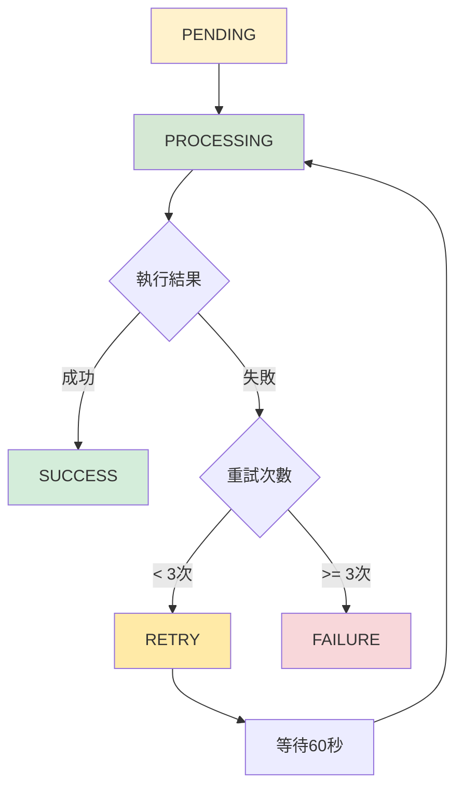

# VocalBorn Celery + Redis 任務處理完整流程圖

## 📋 目錄

- [主要處理流程](#主要處理流程)
- [Redis 資料結構詳細說明](#redis-資料結構詳細說明)
- [錯誤處理流程](#錯誤處理流程)
- [系統監控視圖](#系統監控視圖)
- [任務狀態生命週期](#任務狀態生命週期)
- [效能監控指標](#效能監控指標)

---

## 🔄 主要處理流程

```
┌─────────────────────────────────────────────────────────────────────────────────────────┐
│                            VocalBorn AI 分析任務處理流程圖                                │
└─────────────────────────────────────────────────────────────────────────────────────────┘

📱 用戶端                    🌐 FastAPI                    📦 Redis                   🔧 Celery Worker
   │                           │                           │                          │
   │ 1. POST /analyze          │                           │                          │
   ├─────────────────────────→ │                           │                          │
   │                           │ 2. 驗證用戶權限           │                          │
   │                           │    檢查 PracticeRecord    │                          │
   │                           │                           │                          │
   │                           │ 3. 建立 AIAnalysisTask    │                          │
   │                           │    status: PENDING        │                          │
   │                           │                           │                          │
   │                           │ 4. 提交任務到 Redis       │                          │
   │                           ├─────────────────────────→ │                          │
   │                           │                           │ ┌──────────────────────┐ │
   │                           │                           │ │   Task Queue         │ │
   │                           │                           │ │   (ai_analysis)      │ │
   │                           │                           │ │                      │ │
   │                           │                           │ │ task_id: uuid        │ │
   │                           │                           │ │ args: [record_id,    │ │
   │                           │                           │ │       params]        │ │
   │                           │                           │ │ status: PENDING      │ │
   │                           │                           │ └──────────────────────┘ │
   │                           │                           │                          │
   │ 5. 立即回應任務 ID        │                           │                          │
   │ {"task_id": "xxx",        │                           │                          │
   │  "status": "pending"}     │                           │                          │
   ←─────────────────────────  │                           │                          │
   │                           │                           │                          │
   │                           │                           │ 6. Worker 輪詢佇列     │
   │                           │                           │ ←─────────────────────  │
   │                           │                           │                          │
   │                           │                           │ 7. 取得任務             │
   │                           │                           │ ─────────────────────→ │
   │                           │                           │                          │
   │                           │                           │                          │ 8. 開始處理
   │                           │                           │                          │    status: PROCESSING  
   │                           │                           │                          │    progress: 10%
   │                           │                           │                          │
   │                           │                           │ 9. 更新任務狀態        │
   │                           │                           │ ←─────────────────────  │
   │                           │                           │ ┌──────────────────────┐ │
   │                           │                           │ │   Result Cache       │ │
   │                           │                           │ │                      │ │
   │                           │                           │ │ task_id: uuid        │ │
   │                           │                           │ │ status: PROCESSING   │ │
   │                           │                           │ │ progress: 10%        │ │
   │                           │                           │ │ current_step: "初始化" │ │
   │                           │                           │ └──────────────────────┘ │
   │                           │                           │                          │
   │ 10. 輪詢任務狀態          │                           │                          │
   ├─────────────────────────→ │ 11. 從 Redis 讀取狀態   │                          │
   │                           ├─────────────────────────→ │                          │
   │                           │                           │                          │
   │ 12. 返回當前狀態          │                           │                          │
   │ {"status": "processing",  │                           │                          │
   │  "progress": 40%}         │                           │                          │
   ←─────────────────────────  │                           │                          │
   │                           │                           │                          │
   │        ⋮                  │           ⋮               │            ⋮             │
   │   (持續輪詢)               │      (狀態更新)          │     (進度追蹤)            │
   │        ⋮                  │           ⋮               │            ⋮             │
   │                           │                           │                          │
   │                           │                           │                          │ 13. AI 模型運算
   │                           │                           │                          │     - 下載音訊檔案
   │                           │                           │                          │     - 呼叫 AI 服務
   │                           │                           │                          │     - 處理分析結果
   │                           │                           │                          │     progress: 40→90%
   │                           │                           │                          │
   │                           │                           │ 14. 持續更新狀態        │
   │                           │                           │ ←─────────────────────  │
   │                           │                           │                          │
   │                           │                           │                          │ 15. 儲存最終結果
   │                           │                           │                          │     status: SUCCESS
   │                           │                           │                          │     progress: 100%
   │                           │                           │                          │
   │                           │                           │ 16. 完成狀態更新        │
   │                           │                           │ ←─────────────────────  │
   │                           │                           │ ┌──────────────────────┐ │
   │                           │                           │ │   Final Result       │ │
   │                           │                           │ │                      │ │
   │                           │                           │ │ task_id: uuid        │ │
   │                           │                           │ │ status: SUCCESS      │ │
   │                           │                           │ │ progress: 100%       │ │
   │                           │                           │ │ result_id: uuid      │ │
   │                           │                           │ └──────────────────────┘ │
   │                           │                           │                          │
   │ 17. 最終狀態查詢          │                           │                          │
   ├─────────────────────────→ │ 18. 檢查完成狀態        │                          │
   │                           ├─────────────────────────→ │                          │
   │                           │                           │                          │
   │ 19. 獲取分析結果          │                           │                          │
   ├─────────────────────────→ │ 20. 從資料庫讀取結果    │                          │
   │                           │                           │                          │
   │ 21. 返回完整分析結果      │                           │                          │
   │ {"overall_score": 85.5,   │                           │                          │
   │  "suggestions": "..."}    │                           │                          │
   ←─────────────────────────  │                           │                          │
```

---

## 📦 Redis 資料結構詳細說明

### Database 0: 任務佇列 (Task Queue)

```
┌──────────────────────────────────────────────────────────────────────────────────────────┐
│ Key: celery                                                                              │
│ Type: List (FIFO Queue)                                                                  │
│                                                                                          │
│ ┌─────────────────────┐  ┌─────────────────────┐  ┌─────────────────────┐               │
│ │ Task 1              │  │ Task 2              │  │ Task 3              │               │
│ │ ─────────────────── │  │ ─────────────────── │  │ ─────────────────── │               │
│ │ id: uuid-1          │  │ id: uuid-2          │  │ id: uuid-3          │               │
│ │ task: analyze_audio │  │ task: analyze_audio │  │ task: analyze_audio │               │
│ │ args: [record_id_1] │  │ args: [record_id_2] │  │ args: [record_id_3] │               │
│ │ queue: ai_analysis  │  │ queue: ai_analysis  │  │ queue: ai_analysis  │               │
│ │ eta: null           │  │ eta: null           │  │ eta: null           │               │
│ └─────────────────────┘  └─────────────────────┘  └─────────────────────┘               │
│     ↑ (Pop)                                                       ↓ (Push)             │
│   Worker                                                         新任務                 │
└──────────────────────────────────────────────────────────────────────────────────────────┘
```

### Database 1: 結果快取 (Result Cache)

```
┌──────────────────────────────────────────────────────────────────────────────────────────┐
│ Key Pattern: celery-task-meta-{task_id}                                                  │
│ Type: Hash                                                                               │
│                                                                                          │
│ ┌─────────────────────────────────────────────────────────────────────────────────────┐  │
│ │ Key: celery-task-meta-550e8400-e29b-41d4-a716-446655440000                         │  │
│ │                                                                                     │  │
│ │ status: "PROCESSING"              ← 任務狀態                                        │  │
│ │ result: null                      ← 最終結果 (完成後填入)                           │  │
│ │ traceback: null                   ← 錯誤堆疊 (失敗時填入)                           │  │
│ │ children: []                      ← 子任務 (通常為空)                               │  │
│ │ date_done: null                   ← 完成時間                                        │  │
│ │ task_id: "550e8400-..."           ← 任務 ID                                         │  │
│ │                                                                                     │  │
│ │ # 自定義進度資訊                                                                   │  │
│ │ progress: 65                      ← 進度百分比                                      │  │
│ │ current_step: "AI 模型分析中"      ← 當前步驟描述                                   │  │
│ │ worker_name: "worker@hostname"    ← 執行的 Worker                                  │  │
│ │ started_at: "2024-01-01T12:00:00Z" ← 開始時間                                      │  │
│ └─────────────────────────────────────────────────────────────────────────────────────┘  │
│                                                                                          │
│ TTL: 3600 seconds (1 hour)  ← 自動過期時間                                             │
└──────────────────────────────────────────────────────────────────────────────────────────┘
```

### Redis 指令範例

```bash
# 查看佇列長度
LLEN celery

# 查看佇列中的任務 (不移除)
LRANGE celery 0 -1

# 查看任務狀態
HGETALL celery-task-meta-550e8400-e29b-41d4-a716-446655440000

# 查看所有任務狀態 keys
KEYS celery-task-meta-*

# 清理過期的任務結果
EXPIRE celery-task-meta-550e8400-e29b-41d4-a716-446655440000 3600
```

---

## ⚠️ 錯誤處理流程

```
┌─────────────────────────────────────────────────────────────────────────────────────────┐
│                              錯誤處理與重試機制                                         │
└─────────────────────────────────────────────────────────────────────────────────────────┘

正常流程 ──→ 執行任務 ──→ 成功 ──→ 更新狀態 SUCCESS
    │             │
    │             ↓ (發生錯誤)
    │         捕獲異常
    │             │
    │             ↓
    │    ┌─────────────────┐      是     ┌──────────────────┐
    │    │ 重試次數 < 3 ? │ ──────────→ │ 更新狀態 RETRY   │
    │    └─────────────────┘             └──────────────────┘
    │             │                              │
    │             │ 否                          │
    │             ↓                              ↓
    │    ┌─────────────────┐                     │
    │    │ 更新狀態 FAILURE │                    │
    │    └─────────────────┘                     │
    │             │                              │
    │             ↓                              │
    │    ┌─────────────────┐      延遲60秒       │
    │    │ 記錄錯誤訊息    │ ←───────────────────┘
    │    └─────────────────┘
    │             │
    │             ↓
    │    ┌─────────────────┐
    │    │ 重置 Practice   │
    │    │ Record 狀態     │
    │    └─────────────────┘
    │             │
    │             ↓
    └────→ 任務結束 (失敗)
```

### 錯誤類型處理

| 錯誤類型 | 重試策略 | 延遲時間 | 最大重試 |
|---------|---------|---------|---------|
| 網路錯誤 | 指數退避 | 30s, 60s, 120s | 5次 |
| AI服務錯誤 | 固定延遲 | 60s | 3次 |
| 檔案錯誤 | 不重試 | - | 0次 |
| 超時錯誤 | 固定延遲 | 120s | 2次 |

### Redis 中的錯誤資訊

```
┌──────────────────────────────────────────────────────────────────────────────────────────┐
│ Key: celery-task-meta-{failed_task_id}                                                   │
│                                                                                          │
│ status: "FAILURE"                                                                        │
│ result: null                                                                             │
│ traceback: "Traceback (most recent call last):\n  File..."                              │
│ children: []                                                                             │
│ date_done: "2024-01-01T12:05:30.123Z"                                                   │
│ task_id: "550e8400-..."                                                                  │
│ error_message: "AI 模型服務無法連接: Connection timeout"                                  │
│ retry_count: 3                                                                           │
│ max_retries: 3                                                                           │
│ worker_name: "worker@srv1"                                                               │
│ failed_at: "2024-01-01T12:05:30Z"                                                       │
└──────────────────────────────────────────────────────────────────────────────────────────┘
```

---

## 📊 系統監控視圖

### Flower 監控介面

```
┌─────────────────────────────────────────────────────────────────────────────────────────┐
│                            Flower 監控介面資訊                                          │
└─────────────────────────────────────────────────────────────────────────────────────────┘
```

#### Active Tasks (進行中任務)

| Task ID | Name | State | Progress | Worker | Started At |
|---------|------|--------|----------|---------|------------|
| 550e8400-... | analyze_audio | PROCESSING | 65% | worker@srv1 | 12:00:15 |
| 661f9511-... | analyze_audio | PROCESSING | 20% | worker@srv1 | 12:01:02 |
| 772fa622-... | analyze_audio | PENDING | 0% | - | - |

#### Queue Status (佇列狀態)

| Queue Name | Pending Tasks | Active Tasks | Workers | Throughput/min |
|------------|---------------|--------------|---------|----------------|
| ai_analysis | 3 | 2 | 4 | 15 |

#### Worker Status (Worker 狀態)

| Worker Name | Status | Active | Processed | Failed | Load Avg | Memory Usage |
|-------------|--------|--------|-----------|--------|----------|--------------|
| worker@srv1 | Online | 2 | 145 | 3 | 1.2 | 512MB |

---

## 🔄 任務狀態生命週期



### 狀態說明

- **PENDING**: 任務已提交到佇列，等待 Worker 處理
- **PROCESSING**: Worker 正在執行任務，包含進度追蹤
- **SUCCESS**: 任務執行成功，結果已儲存
- **FAILURE**: 任務執行失敗，達到最大重試次數
- **RETRY**: 任務執行失敗，準備重試

---

## 📈 效能監控指標

### 關鍵指標

```
┌─────────────────────────────────────────────────────────────────────────────────────────┐
│                                效能監控指標                                             │
└─────────────────────────────────────────────────────────────────────────────────────────┘

📊 任務處理指標:
├── 平均處理時間: 35.2 秒
├── 成功率: 94.5%
├── 失敗率: 5.5%
└── 重試率: 12.3%

📊 佇列狀態指標:
├── 當前佇列長度: 3 個任務
├── 平均等待時間: 2.1 秒
├── 最長等待時間: 15.6 秒
└── 每小時處理量: 85 個任務

📊 Worker 效能指標:
├── Worker 數量: 4 個
├── CPU 使用率: 65%
├── 記憶體使用率: 512MB / 2GB
└── 網路IO: 125 KB/s

📊 Redis 效能指標:
├── 記憶體使用: 256MB / 2GB
├── 連線數: 12 / 100
├── QPS: 450 queries/sec
└── 命中率: 98.2%
```

### 告警閾值設定

```yaml
alerts:
  - name: 佇列積壓告警
    condition: queue_length > 50
    severity: warning
    
  - name: 任務失敗率告警
    condition: failure_rate > 10%
    severity: critical
    
  - name: Worker 離線告警
    condition: active_workers == 0
    severity: critical
    
  - name: 處理時間異常告警
    condition: avg_processing_time > 60s
    severity: warning
    
  - name: Redis 記憶體使用告警
    condition: redis_memory_usage > 80%
    severity: warning
```

---

## 🔍 故障排除指南

### 常見問題與解決方案

#### 1. 任務長時間停留在 PENDING 狀態

**原因分析**:
- Worker 未啟動或已停止
- Redis 連線問題
- 佇列配置錯誤

**解決步驟**:
```bash
# 檢查 Worker 狀態
celery -A src.tasks.celery_app inspect active

# 檢查 Redis 連線
redis-cli ping

# 重啟 Worker
docker restart vocalborn-celery-worker
```

#### 2. 任務執行超時

**原因分析**:
- AI 模型服務回應緩慢
- 網路連線不穩定
- 音訊檔案過大

**解決步驟**:
```bash
# 檢查 AI 服務狀態
curl -f http://ai-service:8001/health

# 調整超時設定
export CELERY_TASK_TIME_LIMIT=1800  # 30 分鐘

# 監控網路狀況
ping ai-service
```

#### 3. 記憶體使用過高

**原因分析**:
- Worker 處理大量任務未釋放記憶體
- Redis 快取積累過多資料
- 記憶體洩漏問題

**解決步驟**:
```bash
# 定期重啟 Worker
docker restart vocalborn-celery-worker

# 清理過期的 Redis 資料
redis-cli --scan --pattern "celery-task-meta-*" | xargs redis-cli del

# 調整 Worker 設定
export CELERY_WORKER_MAX_TASKS_PER_CHILD=100
```

---

## 📝 維運檢查清單

### 日常檢查 (每日)

- [ ] 檢查 Worker 狀態是否在線
- [ ] 檢查佇列長度是否正常 (< 10)
- [ ] 檢查任務成功率 (> 90%)
- [ ] 檢查 Redis 記憶體使用 (< 70%)
- [ ] 檢查錯誤日誌是否有異常

### 週期檢查 (每週)

- [ ] 清理過期的任務結果
- [ ] 分析任務處理效能趨勢
- [ ] 檢查並更新監控告警規則
- [ ] 備份重要的配置檔案
- [ ] 測試災難恢復流程

### 月度檢查 (每月)

- [ ] 系統效能全面評估
- [ ] 容量規劃和擴展評估
- [ ] 安全性檢查和更新
- [ ] 文件更新和維護
- [ ] 團隊培訓和知識分享

---

*本文件描述了 VocalBorn 系統的 Celery + Redis 任務處理完整流程，包含所有關鍵組件的互動方式、錯誤處理機制、監控指標和維運指南。*